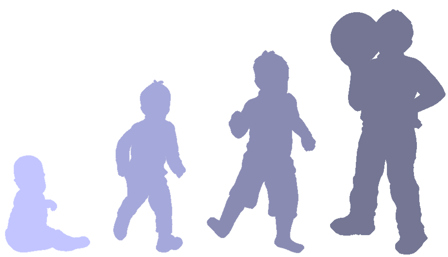

# راهنمای والدین و مراقبین برای کمک به سازگاری کودکان و نوجوانان در بحران همه‌گیری ویروس کرونا

اطلاعات مربوط به ویروس کرونا به سرعت دچار تغییرات اساسی می‌شود و هر چند روز شاهد تأیید و یا تکذیب جزئیات زیادی هستیم و همین موضوع پرسش‌های بیشتری را در ذهن کودکان و نوجوانان مطرح می‌کند. در این میان اولین اولویت‌ خانواده‌ها، محافظت و مراقبت از خانواده و کودکان خواهد بود.

داشتن اطلاعات حیاتی در مورد شرایط و آماده بودن برای هر گونه اتفاق می‌تواند به کاهش اضطراب، ایجاد آرامش و جلوگیری از هرگونه رفتار حساب نشده کمک کند.
کودکان ممکن است بسته به سن‌شان واکنش‌های متفاوتی را به بحران نشان دهند. برای کمک به آنها برای انطباق بهتر روش‌های زیر پیشنهاد می‌شود.

## سنین پیش دبستان

### انواع واکنش‌ها:

- ترس از تنها ماندن و ازدست دادن مراقبین
- مشکلات گفتاری ناشی از استرس
- از دست دادن کنترل ادرار و مدفوع
- بی اشتهایی یا امتناع از غذا خوردن
- اختلال در خوابیدن و کابوس دیدن
- افزایش بدخلقی، غر زدن و چسبندگی بیشتر به والدین

### چطور می‌توان کمک کرد؟

- کمک به حفظ آرامش خود و کودک.
- اطمینان بخشی کلامی و فیزیکی (بغل کردن و نوازش).
- تشویق کودک برای توضیح افکار و احساسات از طریق نقاشی، بازی، قصه گویی و اجرای نمایش.
- شعر خواندن، قصه خواندن، خواندن کتاب قصه های تصویری.
- استفاده از موسیقی کودکانه و تولید موزیک با استفاده از قاشق، چنگال و ... با کودک برای افزایش آرامش وی.
- آرامش بخشی به کودک قبل از خواب با انجام بازی‌های آرام، نرمش‌های کششی، قصه گفتن و پخش موسیقی آرامش دهنده برای بهبود خواب کودک.
- حفظ روال های روزانه (مثل غذا خوردن با یکدیگر).
- جلوگیری از مواجهه با اخبار و اطلاعاتی که برای کودک قابل درک نیست.

")

## سن مدرسه (۶-۱۲ سال)

### انواع واکنش‌ها:

-     بدخلقی، نق زدن، گله و شکایت مداوم
- تحریک پذیری، پرخاشگری، لجبازی و مقایله جویی
- وابستگی به والدین و ترس از ازدست دادن آن ها
- اختلال خواب و کابوس‌های شبانه
- مشکلات اشتها (پرخوری عصبی و کم خوری)
- علائم بدنی همچون سردرد و دل درد
- از دست دادن علاقه به بازی‌ها یا صحبت با همسالان
- افزایش تعارض در رابطه با با افراد خانواده
- مشکلات یادگیری و تمرکز

### چطور می‌توان کمک کرد؟

- حفظ آرامش خود و صبر و تحمل در برابر واکنش های احتمالی کودک
- گفتگو با کودک در مورد احساسات و افکارش و اطمینان بخشی به وی.
- وقت گذاشتن با کودک برای بازی دونفره و بازی های دست جمعی در خانه.
- انجام فعالیت هایی مثل کتاب خواندن، نقاشی کشیدن با کودک، و استفاده از موزیک و موسیقی‌های مناسب برای ایجاد آرامش
- فر اهم نمودن امکان تماس با دوستان از طریق تلفن و یا اینترنت.
- تشویق وی به ورزش‌ های منظم و کششی.
- کمک به کودک برای انجام تکالیف درسی و انجام آن ها در یک ساعت مشخص در طول روز.
- مشارکت در کارهای خانه و محول کردن مسئولیت به کودکان و انجام کارهای منزل در قالب کار گروهی.
- محدود کردن مواجهه با رسانه ها و اطلاعات غیر معتبر.

")

## نوجوانی (۱۱-۱۸ سال)

### انواع واکنش‌ها:

- نشانه‌های جسمی  همچون جوش های پوستی و یا سردرد
- اختلال خواب و اشتها
- تحریک پذیری، بی‌حسی و کاهش انرژی
- اهمیت ندادن به رعایت بهداشت و اقدام های پیشگیرانه
- دوری کردن از همسالان و افراد مورد علاقه
- نگرانی در مورد برچسب بیماری
- اجتناب از مدرسه برای دوران بعد از قرنطینه

### چطور می‌توان کمک کرد؟

- حفظ آرامش، صبر و تحمل و اطمینان بخشی به نوجوان.
- تشویق و پیگیری انجام روال های روزمره.
- تشویق (و نه تحمیل!) بیان احساسات نسبت به شرایط با همسالان و خانواده.
- تسهیل حفظ ارتباط با دوستان و اقوام از طریق تلفن و اینترنت.
- صحبت و گفتگو در مورد علائق آن ها مثل موزیک، فیلم، دوستان و ...
- انجام فعالیت های مورد علاقه مشترک مثل دیدن فیلم و شنیدن موسیقی و ...
- ایجاد حس مسئولیت در کارهای خانه و ایجاد فضای همکاری در فعالیت های روزمره. مثل کمک به خواهر و برادر کوچک و تشویق برای ایجاد ایده‌های جدید برای رعایت بهداشت روانی و جسمی.
- کاهش مواجهه با رسانه از طریق محدود کردن زمان مواجهه با اخبار.
- گوش دادن به نوجوان و توجه کردن به احساسات وی.
- گفتگو در مورد نگرانی ها، دیده ها و شنیده هایی که ذهن نوجوان را درگیر کرده است.
- اجتناب از بیان اغراق آمیز مشکلات و معضلات خانوادگی و اجتماعی.

## تهیه و تدوین

طلیعه شیخ فندرسکی
دانشجوی دکترای علوم شناختی ، گرایش روانشناسی شناختی
واحد کاردرمانی، بخش روانپزشکی کودک و نوجوان
بیمارستان روزبه - دانشگاه علوم پزشکی تهران

منابع:

1. Parent/Caregiver Guide to Helping Families Cope with the Coronavirus Disease 2019 (COVID-19): 2020. The National Child Traumatic Stress Network
2. https://www.end-violence.org/protecting-children-during-covid-19-outbreak
